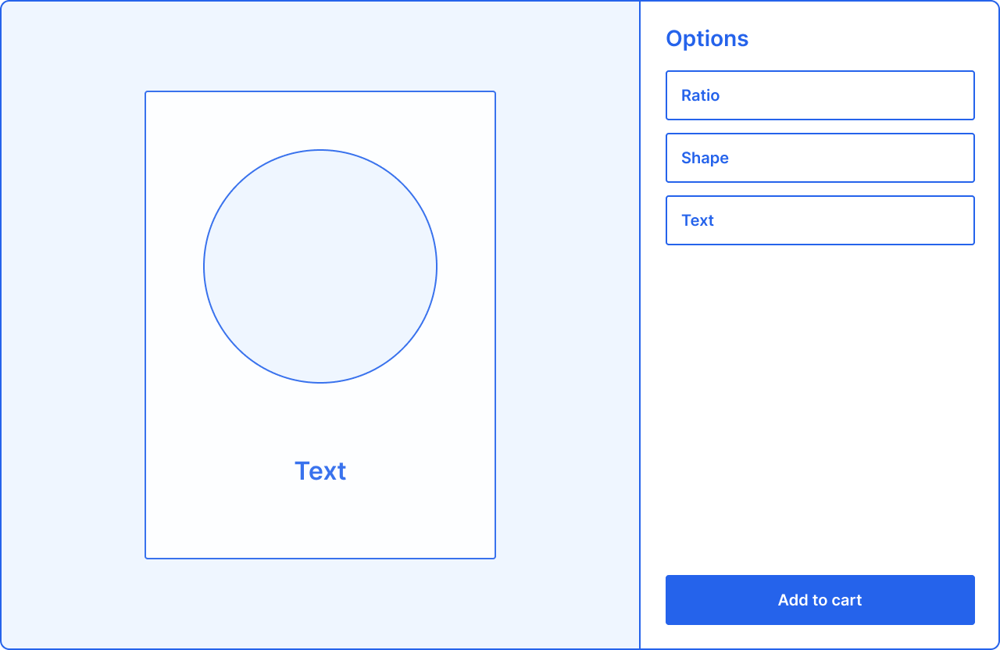

# Frontend Challenge

## Introduction

The estimated time for this challenge is around 4 hours. Please submit your results 1 day before the technical interview at the latest. Your contact is Paul (paul@momenterie.com). If any of the requirements are unclear or you get stuck, please don’t hesitate to reach out. We’re excited to see your approach to this challenge. Good luck!

## Your assignment

Our product editor is the core of the frontend development work at Momenterie. It works the same for every product: there's a menu with all the inputs on the right, and a preview of the product that updates in real time on the left. Your task is to implement a simple version of it in Vue.js. Start by forking this repository and creating a new branch. When you're done, go ahead and open a pull request and explain how to run your code in the pull request's description. Don't forget to give Paul read access to your repository so we can check it out. 

Here's a wireframe of the layout and the features we'd like to see:

### Requirements

- The project is developed in Vue.js with TypeScript.
- The editor looks visually appealing and some thought went into UX.
  - Pixel perfection is not necessary.
  - Please do not use libraries like Tailwind CSS or replicate Momenterie's editor design.
- There's a menu and a preview of the product. The product is a simple poster with a shape and some text on it.
- The menu contains the following inputs for customizing the product:
  - **Ratio**: Aspect ratio of the product. Support at least 3 options, e.g. 2x3, 3x4, 5x7.
  - **Shape**: Shape displayed at the top. There are some .svg files under resources/ which you can use.
  - **Text**: Text displayed at the bottom. Validation is not necessary.
- The menu contains an "Add to cart" button that's disabled until the text is changed.
- The product should not be easy to break by changing any of the inputs.
- The product preview automatically updates to reflect the current state of the inputs.
- The editor is responsive (only mobile and desktop, ignore edge cases).
  - The product should fit the preview area on each screen size. Elements on the product should keep their ratio.
  - If refreshing the page is necessary for the product to fit, that's okay.

### Got more to show?

It's absolutely not a requirement, but if you want to demonstrate even more of your skills, we're here for it! This could include extending product functionality, validating inputs, adding interaction or persisting data by integrating the editor with a small backend.

> [!IMPORTANT]
> We will never use code submitted as part of this challenge for purposes outside the interview process.

## What we are looking for

- **Code quality**: Your code is clean, well-organized, and readable. You structure your code thoughtfully, and follow best practices to ensure maintainability.
- **Problem solving**: You tackle challenges effectively and creatively. Demonstrate how you approach and solve technical issues within the scope of the task.
- **Sense of aesthetics and usability**: The interfaces you build balance visual appeal with intuitive functionality, showing thoughtful design choices that make the application both attractive and easy to use.

> [!NOTE]
> Pixel perfection is not required; we’re more interested in understanding the direction and thought process behind your decisions. If you are stuck, feel free to reach out. It's part of the job.

## Helpful resources

- [Project scaffolding in Vue](https://vuejs.org/guide/scaling-up/tooling.html#project-scaffolding)
- [Momenterie Starmap](https://momenterie.com/pages/starmap-editor)

